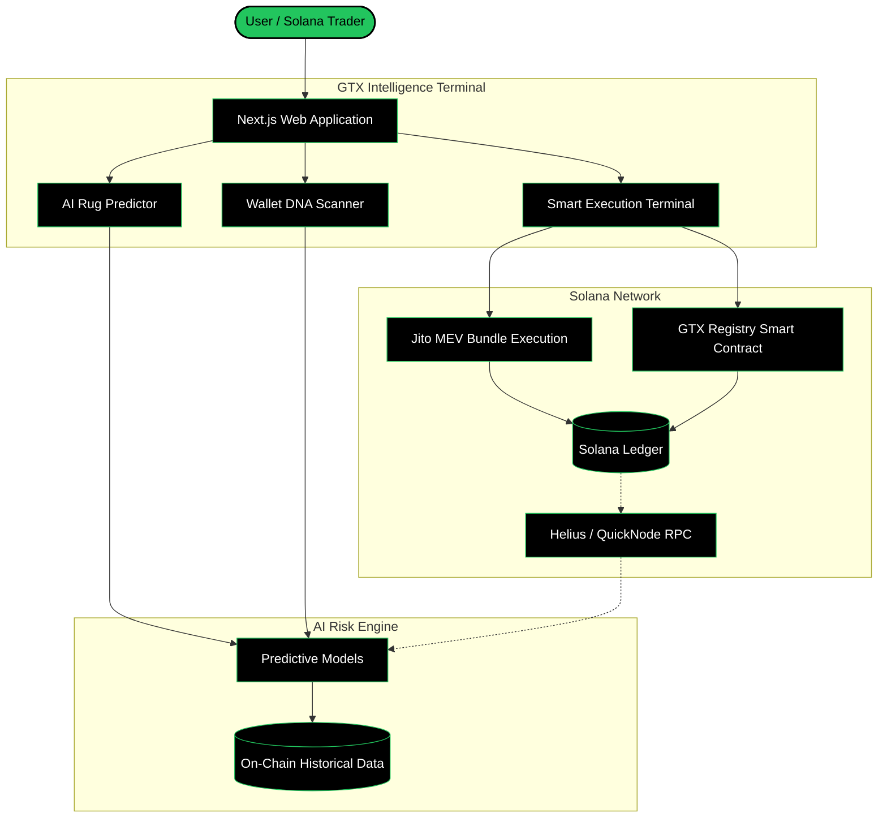

# GTX.SYS - AI Security Infrastructure for Solana Traders


GTX is a production-ready, AI-powered Solana trading security platform. It acts as an institutional-grade intelligence terminal designed to protect retail traders from rug pulls, scam tokens, sniper traps, and whale manipulation before they execute a trade. 

Think of it as: **ChatGPT + Arkham + Photon + Jito = GTX**

## 🏗 System Architecture

The following diagram illustrates the data flow and system architecture of the GTX platform.



---

## 🔥 Core Features

### 1. AI Rug Pull Predictor
Before buying any token, GTX analyzes liquidity, holder concentration, dev wallet history, and social sentiment to generate a **Safe Score** and a detailed, explainable AI output detailing rug pull probabilities.

### 2. Wallet DNA Scanner
Paste any Solana wallet address to generate a **Wallet Personality Report**. The AI instantly identifies sniper bots, insider accumulation wallets, scam deployers, or trusted smart money.

### 3. Smart Jito Execution Engine
Execute trades with sub-500ms UX. Uses Jito bundles for MEV protection, priority fee optimization, and smart routing via Jupiter to ensure your trade is protected from sandwich attacks.

### 4. GTX Registry Smart Contract
Built with Rust and Anchor. Users can permanently record Wallet DNA audits directly onto the Solana blockchain, creating an immutable ledger of identified malicious or high-risk actors.

---

## 💻 Tech Stack

**Frontend:**
* Next.js 14 & TypeScript
* Tailwind CSS & Shadcn UI (Cyberpunk Aesthetic)
* Framer Motion (Micro-animations & Live Node Maps)
* Recharts

**Blockchain Integration:**
* Solana Web3.js (`@solana/web3.js`)
* Solana Wallet Adapter (`@solana/wallet-adapter-react`)
* Rust & Anchor Framework (Smart Contracts)

**AI & Backend Infrastructure:**
* Python, FastAPI, Scikit-learn (Machine Learning Models)
* Helius API & QuickNode (On-chain data ingestion)
* PostgreSQL & Redis (User data & caching)

---

## 🚀 Getting Started (Local Development)

### 1. Clone the repository
```bash
git clone https://github.com/mansiverma897993/GTX.git
cd GTX
```

### 2. Install dependencies
```bash
npm install
```

### 3. Run the development server
```bash
npm run dev
```
Navigate to `http://localhost:3000` to view the intelligence terminal.

---

## 🔗 Smart Contract Deployment
The `gtx_registry` Anchor smart contract is located in the `/contract` directory. 
To deploy it without installing local Rust toolchains:
1. Open [Solana Playground](https://beta.solpg.io/).
2. Create a new Anchor project and paste the contents of `/contract/programs/gtx_registry/src/lib.rs`.
3. Build, Connect your Devnet Wallet, and click Deploy.
4. Update the Program ID in the Next.js frontend to complete the integration.
